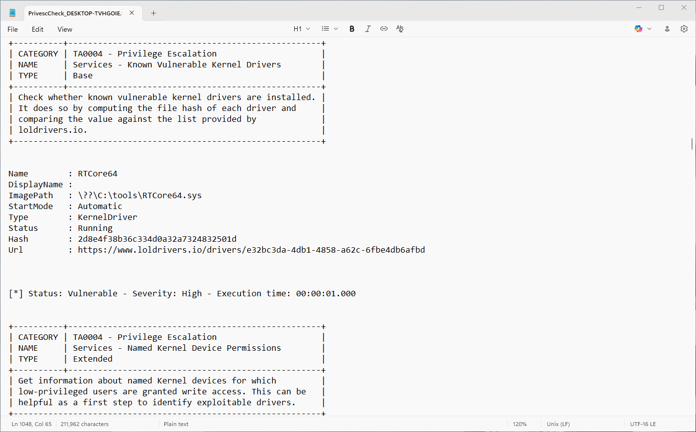
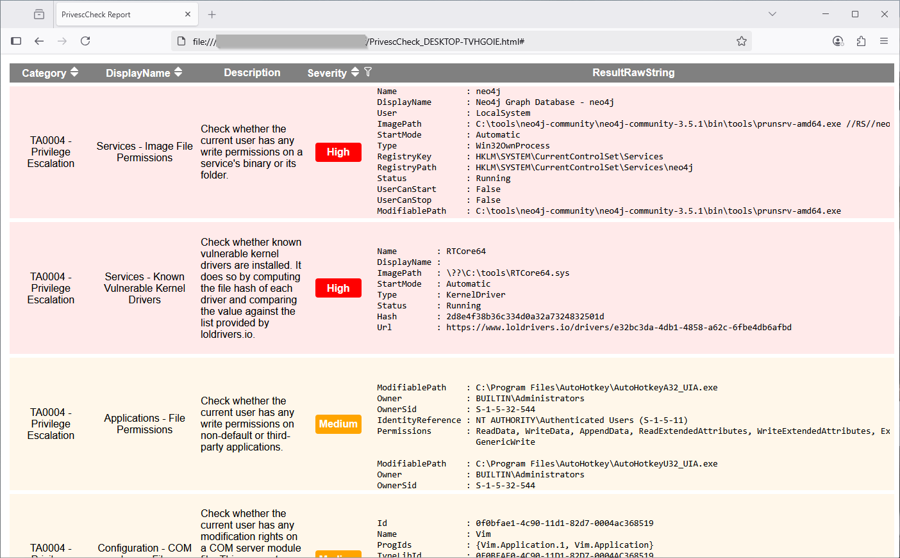

# PrivescCheck

Quickly identify common Windows **vulnerabilities** and **configuration issues** that are not necessarily covered by public security standards, and collect useful information for exploitation and post-exploitation tasks.

> :information_source: Although this tool is primarily intended for pentesters, it can (and should) also be used by defenders to identify weaknesses on Windows endpoints.

## :rocket: Quick Start

:warning: The script **IS NO LONGER** available in the repository, check out the [latest release](https://github.com/itm4n/PrivescCheck/releases/latest/) instead.

Download the script here: [PrivescCheck.ps1](https://github.com/itm4n/PrivescCheck/releases/latest/download/PrivescCheck.ps1)

> :information_source: The link above can also be used directly in a PowerShell terminal with `(New-Object Net.WebClient).DownloadString(...)`.

Below are 3 typical use cases for the tool, but of course you can "mix and match" the options as you wish.

### Use Case 1 (Pentest): Run Basic Checks Only

:dart: **Objective:** I want to know if there is any obvious way I can escalate my privileges.

```bat
powershell -ep bypass -c ". .\PrivescCheck.ps1; Invoke-PrivescCheck"
```

### Use Case 2 (Research): Run Extended Checks + Write Human-Readable Reports

:dart: **Objective**: There is no obvious vulnerability, but I want to dig a little further (and potentially find an 0-day in some third-party software for instance).

```bat
powershell -ep bypass -c ". .\PrivescCheck.ps1; Invoke-PrivescCheck -Extended -Report PrivescCheck_$($env:COMPUTERNAME) -Format TXT,HTML"
```

### Use Case 3 (Audit): Run All Checks + Write All Reports

:dart: **Objective**: I want to further scan the machine in case there are configuration issues that are not covered by common security standards, and optionally feed the results into an automated reporting tool.

```bat
powershell -ep bypass -c ". .\PrivescCheck.ps1; Invoke-PrivescCheck -Extended -Audit -Report PrivescCheck_$($env:COMPUTERNAME) -Format TXT,HTML,CSV,XML"
```

## :open_book: Detailed Usage

```txt
Invoke-PrivescCheck [-Extended] [-Audit] [-Experimental] [-Report <PREFIX>]
    [-Format <FORMAT>[,...]] [-Risky] [-Silent] [-Force]

    -Extended
        Include all "extended" checks in the scan (see README).

    -Audit
        Include all "audit" checks in the scan.

    -Experimental
        Include all "experimental" checks in the scan. Use only if you know
        what you are doing.

    -Report <PREFIX>
        Generate at least one report file. The output filename will be
        "PREFIX.txt" by default. The extension is automatically appended
        based on the report format (see "-Format <FORMAT>[,...]").

    -Format <FORMAT>[,...]
        Specify the format of the output report file(s). If not set, the
        default value is "TXT". Supported formats are: "TXT", "HTML", "CSV",
        and "XML".

    -Risky
        Include checks marked as "risky", i.e. checks that are likely to
        trigger a blocking action by an endpoint protection solution. Use with
        caution.

    -Silent
        Suppress terminal output. This can be useful if you want to run the
        script as part of a batch file, in a scheduled task for instance.

    -Force
        Force execution and ignore warnings. Typically, the script stops if
        it is executed with administrator privileges. Use this option to
        execute it anyway.
```

### Report Format > TXT (`-Format TXT`)

Use the option `-Report <PREFIX>` (with `-Format TXT`) to specify that you want to generate a **raw text report**. The output is similar to what you would see in the terminal, except that it contains only ASCII characters for better (retro-)compatibility will all text editors.



### Report Format > HTML (`-Format HTML`)

Use the option `-Report <PREFIX>` with `-Format HTML` to specify that you want to generate an **HTML report**. The output file can be opened in a web browser. It is more convenient for visualizing the data than the raw text report. Additionally, it offers **sorting** and **filtering** capabilities!



### Report Format > CSV  (`-Format CSV`) & XML  (`-Format XML`)

Use the option `-Report <PREFIX>` with `-Format CSV` or `-Format XML` to specify that you want to generate a **CSV or XML report**. The output file is intended to facilitate the parsing of the results by automated reporting tools.

:information_source: Although the output format is not documented (yet), you can easily figure it out by analyzing the structure of an already generated file. You can use the `Id` value of each check to uniquely identify them.

### Check Type > Base

Checks of type `Base` will always be executed, unless the script is run as an administrator. They are mainly intended for identifying privilege escalation vulnerabilities, or other important issues.

### Check Type > Extended (`-Extended`)

Checks of type `Extended` can only be executed if the option `-Extended` is specified on the command line. They are mainly intended for providing additional information that could be useful for exploit development, or post-exploitation.

### Check Type > Audit (`-Audit`)

Checks of type `Audit` can only be executed if the option `-Audit` is specified on the command line. They are mainly intended for providing information that is relevant in the context of a configuration audit.

## :bulb: Tips & Tricks

### PowerShell Execution Policy

By default, the PowerShell [execution policy](https://learn.microsoft.com/en-us/powershell/module/microsoft.powershell.core/about/about_execution_policies) is set to `Restricted` on clients, and `RemoteSigned` on servers, when a new `powershell.exe` process is started. These policies block the execution of (unsigned) scripts, but they can be overridden within the current scope as follows.

```powershell
Set-ExecutionPolicy Bypass -Scope Process -Force
. .\PrivescCheck.ps1
```

However, this trick does not work when the execution policy is enforced through a GPO. In this case, after starting a new PowerShell session, you can load the script as follows.

```powershell
Get-Content .\PrivescCheck.ps1 | Out-String | Invoke-Expression
```

### PowerShell Version 2

If you see this at the beginning of the script, it just means that the **minimum** PowerShell version required for it to run is PSv2.

```powershell
#Requires -Version 2
```

A common way to bypass [Constrained Language Mode](https://devblogs.microsoft.com/powershell/powershell-constrained-language-mode/) consists in using PSv2 as it does not implement this protection. Therefore, a significant part of the development effort goes into maintaining this retro-compatibility.

> :information_source: Although PowerShell version 2 ~~is still enabled by default on recent versions of Windows~~ ([PowerShell 2.0 removal from Windows](https://support.microsoft.com/en-us/topic/powershell-2-0-removal-from-windows-fe6d1edc-2ed2-4c33-b297-afe82a64200a)), it cannot run without the .Net framework version 2.0, which requires a manual install.

### Metasploit timeout

If you run this script within a Meterpreter session, you will likely get a "timeout" error. This is because Metasploit uses a default timeout value of 15 seconds, which is not enough for a typical execution of the script to complete.

```console
meterpreter > load powershell
Loading extension powershell...Success.
meterpreter > powershell_import /local/path/to/PrivescCheck.ps1
[+] File successfully imported. No result was returned.
meterpreter > powershell_execute "Invoke-PrivescCheck"
[-] Error running command powershell_execute: Rex::TimeoutError Operation timed out.
```

It is possible to set a different timeout thanks to the `-t` option of the `sessions` command ([documentation](https://www.offensive-security.com/metasploit-unleashed/msfconsole-commands/)). In the following example, a timeout of 2 minutes is set for the session with ID `1`, but you might want to set an even higher value.

```console
msf6 exploit(multi/handler) > sessions -t 120 -i 1
[*] Starting interaction with 1...
meterpreter > powershell_execute "Invoke-PrivescCheck"
```

## :bookmark_tabs: Credits

- Word list - [CBHue/PyFuscation](https://github.com/CBHue/PyFuscation)
- Vulnerable driver list - [https://www.loldrivers.io/api/drivers.csv](https://www.loldrivers.io/api/drivers.csv)
